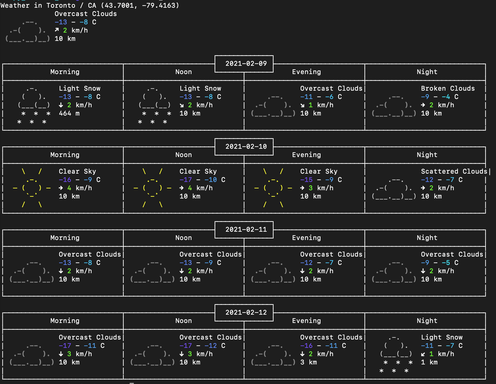

# py_weather_cli

py_weather_cli is a Python version implementation of [wego](https://github.com/schachmat/wego) which is a weather client for the terminal.

This project is just only for study purpose, please do not use it for business.



## Dependencies

- requests
- click

## Installation

```
pip3 install weather_cli

weather_cli -c toronto
```


## Configration

Once you run `py_weather_cli` after installing, you will get error about [OpenWeatherMap](https://openweathermap.org/) account and api key. However the config `.weather-cli` has been generated in `HOME` dirctinary. (it might be hidden due to started '.').

- city_name

    the default city
- api_key

    OpenWeatherMap api_key
- lang

    client language
- num_days  

    the number of days of forecast
- unit  

    measure unit, you can specify any of (metric|imperial|si')